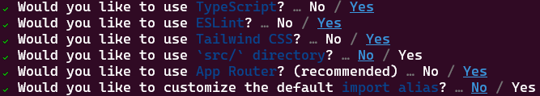

# Superfluid Widget + Lens Protocol

This is an example project showing how to build a simple React UI to start money streams towards wallets which are holding a Lens handle using [Superfluid Subscriptions Widgets](https://www.superfluid.finance/subscriptions).

If you cannot wait and want to see what the dApp looks like right away, here are the steps:
1. Clone this repo
```sh
git clone https://github.com/guelowrd/superfluid-mini-ui
```
2. Install the dependencies
```sh
npm install
# or yarn, pnpm
```
Then go to [the end of this tutorial](https://github.com/guelowrd/superfluid-mini-ui#run-locally) to run the app locally.

*TODO: add screenshot*

Keep reading for the full step-by-step tutorial explaining how to actually make that frontend yourself.

## Objectives

The purpose of this app will be to:
1. Allow the user to input an address in an input field
2. Check that the given address is valid, i.e. does hold a Lens handle
3. If the address is valid, allow the user to create a money stream using Superfluid Subscription Widget

## Setup

First, check that your development environment is ready.

If you don’t have **Node.js** installed, install it from [here](https://nodejs.org/en/). You’ll need Node.js version 10.13 or later.
You’ll be using your own text editor and terminal app for this tutorial.

> If you are on Windows, we recommend using [Windows Subsystem for Linux (WSL)](https://docs.microsoft.com/en-us/windows/wsl/install-win10).

## Create a Next.js app

We are using Next.js to build our dApp, and more specifically the tool ```create-next-app``` which bootstraps a Next.js project for you.
To do so, open your terminal, ```cd``` into the directory you’d like to create the app in, and run the following command:
```sh
npx create-next-app@latest superfluid-mini-ui --use-npm
```



You now have a new directory called ```superfluid-mini-ui```. Let’s ```cd``` into it and open your favorite editor:
```sh
cd superfluid-mini-ui && code .
```

## Install dependencies

### Lens Protocol

In order to check if a given address holds a Lens handle, we will use the GraphQL client [apollo](https://docs.lens.xyz/docs/apollo-client) to query Lens data, and more specificaly [Get default profile](https://docs.lens.xyz/docs/get-default-profile) query.

### Superfluid

[Superfluid Widget](https://docs.superfluid.finance/superfluid/developers/superfluid-subscriptions/superfluid-checkout-widget) offer a smooth UX for payment streams setup and 1-click checkout. This is used at the end of our workflow.

### Wagmi & Web3Modal

[Superfluid Widget](https://docs.superfluid.finance/superfluid/developers/superfluid-subscriptions/superfluid-checkout-widget) is meant to be imported into an existing Wagmi frontend, and works with several wallet connection libraries -- we choose Web3Modal in this project, but others are possible too (e.g. RainbowKit).

To install all these dependencies, we can run ```npm install``` or ```yarn add``` at the root of our project:

```sh
#npm
npm install --save @superfluid-finance/widget wagmi @superfluid-finance/tokenlist @apollo/client graphql @web3modal/ethereum @web3modal/react

#yarn
yarn add @superfluid-finance/widget wagmi @superfluid-finance/tokenlist @apollo/client graphql @web3modal/ethereum @web3modal/react
```

## Use Lens API

Since verifying Lens handle ownership is the first step of our user workflow, let's start with that!

We can create a new folder at the root, ```components```. In this folder we add a new file, ```lens.ts```, with the following code:

```ts
import { ApolloClient, InMemoryCache, gql } from '@apollo/client'

const APIURL = 'https://api-mumbai.lens.dev/';

export const apolloClient = new ApolloClient({
    uri: APIURL,
    cache: new InMemoryCache(),
})
``` 

Doing this, we have created our ```ApolloClient``` that we will use for our API queries.
Now, in the same file, let's add the query we need to return the default profile for a given wallet -- if a given address does not hold a Lens handle, this will return ```null```:

```ts
export const query = gql(`
  query DefaultProfile($address: EthereumAddress!) {
    defaultProfile(request: { ethereumAddress: $address }) {
      id
      name
      bio
      isDefault
      attributes {
        displayType
        traitType
        key
        value
      }
      followNftAddress
      metadata
      handle
      picture {
        ... on NftImage {
          contractAddress
          tokenId
          uri
          chainId
          verified
        }
        ... on MediaSet {
          original {
            url
            mimeType
          }
        }
      }
      coverPicture {
        ... on NftImage {
          contractAddress
          tokenId
          uri
          chainId
          verified
        }
        ... on MediaSet {
          original {
            url
            mimeType
          }
        }
      }
      ownedBy
      dispatcher {
        address
        canUseRelay
      }
      stats {
        totalFollowers
        totalFollowing
        totalPosts
        totalComments
        totalMirrors
        totalPublications
        totalCollects
      }
      followModule {
        ... on FeeFollowModuleSettings {
          type
          contractAddress
          amount {
            asset {
              name
              symbol
              decimals
              address
            }
            value
          }
          recipient
        }
        ... on ProfileFollowModuleSettings {
         type
        }
        ... on RevertFollowModuleSettings {
         type
        }
      }
    }
  }
`)
```

At this stage, your project tree should be:
```sh
.
├── app
│   ├── favicon.ico
│   ├── globals.css
│   ├── layout.tsx
│   └── page.tsx
├── components
│   └── lens.ts
├── public
│   ├── next.svg
│   └── vercel.svg
├── README.md
├── next-env.d.ts
├── next.config.js
├── package-lock.json
├── package.json
├── postcss.config.js
├── tailwind.config.ts
└── tsconfig.json
```

## Setup Superfluid Subscription Widget

We then need to specify the properties of our Superfluid Subscription Widget: ```paymentOptions```, ```paymentDetails``` and ```productDetails```. 
We will create one file for each in our ```components``` folder:

```ts
//paymentOptions.ts
import { PaymentOption } from "@superfluid-finance/widget";

const paymentOptions: PaymentOption[] = [
    {
        chainId: 80001,
        receiverAddress: "0x7BDa037dFdf9CD9Ad261D27f489924aebbcE71Ac",
        superToken: {
            address: "0x42bb40bf79730451b11f6de1cba222f17b87afd7",
        },
        flowRate: {
            amountEther: "12345",
            period: "month",
        },
    },
];

export default paymentOptions;
```

```ts
//paymentDetails.ts
import { PaymentDetails } from "@superfluid-finance/widget";

import paymentOptions from "./paymentOptions";

const paymentDetails: PaymentDetails = {
    paymentOptions,
};

export default paymentDetails;
```

```ts
//productDetails.ts
import { ProductDetails } from "@superfluid-finance/widget";

const productDetails: ProductDetails = {
    name: "Superfluid Mini UI",
    description:
        "Superfluid Mini UI illustrates how to create a basic UI to set up a stream towards some Lens account holders.",
    successText: "Success! End of demo.",
    successURL: "#",
};

export default productDetails;
```

At this stage and until the end, your project file tree should be:
```sh
.
├── app
│   ├── favicon.ico
│   ├── globals.css
│   ├── layout.tsx
│   └── page.tsx
├── components
│   ├── lens.ts
│   ├── paymentDetails.ts
│   ├── paymentOptions.ts
│   └── productDetails.ts
├── public
│   ├── next.svg
│   └── vercel.svg
├── README.md
├── next-env.d.ts
├── next.config.js
├── package-lock.json
├── package.json
├── postcss.config.js
├── tailwind.config.ts
└── tsconfig.json
```

## Configure Wallet Connection

The rest of the logic will be inside ```./app/page.tsx```.
First we can remove the code automatically generated by ```create-next-app``` tool. Then, let's add all the ```import``` statements we need, setup our wallet connectivity configuration, with our ```Home()``` function signature (we will fill it in the next section):

```ts
"use client"
import {
  EthereumClient,
  w3mConnectors,
  w3mProvider,
} from "@web3modal/ethereum";
import { useWeb3Modal, Web3Modal } from "@web3modal/react";
import SuperfluidWidget, {
  EventListeners,
  supportedNetworks,
  WalletManager,
} from "@superfluid-finance/widget";
import superTokenList from "@superfluid-finance/tokenlist";
import { useState, useMemo } from "react";
import { configureChains, createConfig, WagmiConfig, useNetwork } from "wagmi";

import paymentDetails from "../components/paymentDetails";
import productDetails from "../components/productDetails";
import { apolloClient, query } from "../components/lens";

const projectId = "952483bf7a0f5ace4c40eb53967f1368";

const { publicClient } = configureChains(supportedNetworks, [
  w3mProvider({ projectId }),
]);

const wagmiConfig = createConfig({
  autoConnect: false,
  connectors: w3mConnectors({
    projectId,
    chains: supportedNetworks,
  }),
  publicClient,
});
const ethereumClient = new EthereumClient(wagmiConfig, supportedNetworks);

export default function Home() { 
    // This will be filled in the next section!
}
```

## Return the UI

Our ```Home()``` function will return the HTML we need to display the UI. Let's go through it step-by-step:
1. Wallet Manager used by our Superfluid Widget
2. States and functions for our workflow & buttons
3. Lens API function to check the address validity
4. Put everything together

Each piece of code corresponding to each of these steps are to be added inside ```Home()```: 
```ts
// Step 1
  const { open, isOpen } = useWeb3Modal();
  const walletManager = useMemo<WalletManager>(
    () => ({
      open,
      isOpen,
    }),
    [open, isOpen],
  );
```

```ts
// Step 2
  const [recipient, setRecipient] = useState("");
  const [recipientIsValid, setRecipientIsValid] = useState("");

  const handleRecipientChange = (e) => {
    console.log("Set recipient: " + recipient);
    setRecipient(e.target.value);
  }

  const handleRecipientCheck = async () => {
    console.log("Checking recipient...");
    checkRecipient();
  }
```

```ts
// Step 3
  const checkRecipient = async () => {
    const response = await apolloClient.query({
      query: query,
      variables: {
        address: recipient
      }
    });
    setRecipientIsValid(response.data.defaultProfile == null ? "false" : "true");
    console.log("Recipient is valid: " + recipientIsValid);
    console.log(response);
  }
```

```ts
// Step 4
  return (
    <main className="bg-white min-h-screen flex-col items-center justify-between p-24">
      <section className="w-full m-4 flex items-center justify-between">
        <input
          className="w-2/3 h-12 rounded mr-4 p-2 border-2 border-gray-300 hover:border-gray-500 focus:border-gray-700"
          type="text"
          id="recipientInput"
          name="recipientInput"
          placeholder="Enter the recipient address"
          onChange={handleRecipientChange}
        />
        <button
          className="bg-[#1aa023] font-semibold w-1/3 h-12 ml-4 rounded-3xl text-white"
          onClick={handleRecipientCheck}
        >
          Check Recipient
        </button>
      </section>
      <section className="w-full m-4">
        {recipientIsValid == "true" ?
          <>
            <WagmiConfig config={wagmiConfig}>
              <SuperfluidWidget
                productDetails={productDetails}
                paymentDetails={paymentDetails}
                tokenList={superTokenList}
                type="dialog"
                walletManager={walletManager}
              >
                {({ openModal }) => (
                  <button
                    className="bg-[#1aa023] w-full font-semibold h-12 self-auto rounded-3xl text-white"
                    onClick={() => openModal()}
                  >Create Stream</button>
                )}
              </SuperfluidWidget>
            </WagmiConfig>
            <Web3Modal projectId={projectId} ethereumClient={ethereumClient} />
          </>
          : recipientIsValid == "false" ?
            <h3 className="self-auto">
              {recipient} is not a valid recipient address (no Lens handle).
            </h3>
            :
            <h3 className="self-auto">
              Click "Check Recipient" to confirm {recipient} address is valid (i.e. it has a Lens handle).
            </h3>
        }
      </section>
    </main>
  )
```

## Run locally

We are done! Now is the time to see how the dApp looks like. To do so:

1. Run the app locally
```sh
npm run dev
```
2. Open [http://localhost:3000](http://localhost:3000) with your browser to see the result.

*TODO: add screenshots*

## Troubleshooting

You may get these warnings upon compilation: 
```sh
Module not found: Can't resolve 'pino-pretty' / 'lokijs' / 'encoding'
...
```

If so, you can amend your ```next.config.js``` file as follows:
```js
/** @type {import('next').NextConfig} */
const nextConfig = {
    webpack: (config) => {
        config.externals.push("pino-pretty", "lokijs", "encoding")
        return config
    },
}

module.exports = nextConfig
```


*TODO*
* *"No matching key. expirer: topic:6db85e5f5e3a37acaf43c7be57783088b148c1fd9b47a97a1dff6b30c53c0424"*
* *"MUI: The contrast ratio of 2.8225806451612905:1 for #fff on #1DB227"*
* *"Unsuccessful attempt at preloading some images... (25) ['https://explorer-api.walletconnect.com/w3m/v1/getA…"*
* *"Warning: Received `true` for a non-boolean attribute `expanded`."*


## Ressources

[Lens API Doc](https://docs.lens.xyz/docs/querying-from-an-application)

[Superfluid Subscription Doc](https://docs.superfluid.finance/superfluid/developers/superfluid-subscriptions)

[Superfluid Widget Example using web3modal](https://github.com/superfluid-finance/widget/tree/master/examples/widget-vite-react-web3modal)
